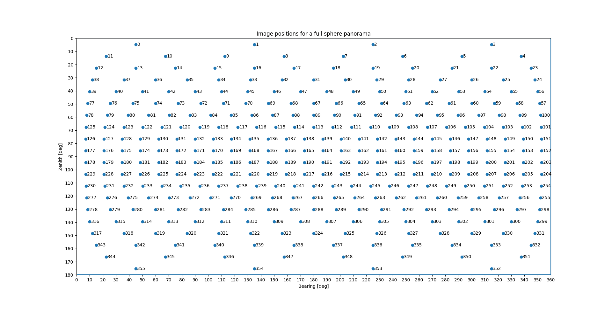

Measuring
=========

To create a panorama image from different images taken from a common center
point, the orientatiobs of the images have to be known among other camera
properties. The necessary data can be derived from independent calibration and
screenshots during the on-board panorama program.

To simplify the process, this command can be used to capture images with the
necessary metadata automatically being recorded as reported by the instrument.

Requirements
------------

- GeoCom capable robotic total station with overview camera and imaging license

Positions
---------

The program takes images in a region defined by a horizontal and vertical angle
range. Two convenience settings exists (in addition to the default), that
reduce the number of angle inputs needed for specific cases:

- region: horizontal and vertical range is required (this is the default)
- strip: 360 degree horizontal coverage with given vertical range
- sphere: complete spherical panorama

.. note::

    The complete sphere panorama is very practical, and more of a proof of
    concept, as capturing the full view takes impractically long time.

Images that are taken at angles that deviate from the horizontal position
cover a wider horizontal angle area. To avoid taking unnecessary images, the
top and bottom rows have fewer images.

Examples
--------

.. code-block:: shell
    :caption: Capturing panorama with interactive region definition and default settings

    iman capture panorama COM1 metadata.json

.. code-block:: shell
    :caption: Capturing full sphere panorama with custom file prefix

    iman capture panorama --shape sphere --prefix panosphere_ COM1 metadata.json

.. code-block:: shell
    :caption: Capturing predefined 360 panorama strip

    iman capture panorama --strip strip --vertical 70-00-00 110-00-00 COM1 metadata.json

Usage
-----

.. click:: instrumentman.panorama:cli_measure
    :prog: iman capture panorama
